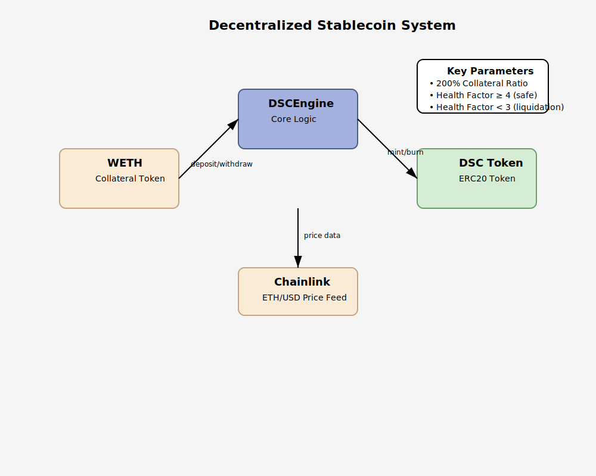

# Decentralized Stablecoin (DSC)

A decentralized, algorithmic stablecoin pegged to the US Dollar, built on the Ethereum blockchain using Solidity and the Foundry framework.

## Overview

This project implements a decentralized stablecoin system inspired by DAI but with several important differences:
- No governance mechanism
- No fees
- Collateralized only by WETH (Wrapped Ethereum)
- Maintained at a 1:1 peg with USD through algorithmic mechanisms
- Always overcollateralized

## Overview


## Key Features

- **200% Collateralization Ratio**: Ensures the system remains solvent even during market volatility
- **Exogenous Collateral**: Uses WETH as its collateral asset
- **Chainlink Price Feeds**: Utilizes Chainlink oracles for accurate ETH/USD price data
- **Liquidation Mechanism**: Allows external actors to liquidate undercollateralized positions with a 10% bonus incentive
- **Reentrancy Protection**: Implements OpenZeppelin's ReentrancyGuard for secure function execution

### System Diagram

The following diagram illustrates the architecture of the DSC system:


## System Architecture

The system consists of two main contracts:

1. **DecentralizedStableCoin.sol**: ERC20 token implementation with mint and burn functionality
2. **DSCEngine.sol**: Core logic contract that handles all collateral and stablecoin operations

## Key Functions

### DSCEngine

- `depositCollateral`: Deposit WETH as collateral
- `mintDSC`: Mint DSC tokens against deposited collateral
- `depositCollateralAndMintDsc`: Perform both actions in a single transaction
- `redeemCollateral`: Withdraw collateral (if health factor remains adequate)
- `burnDSC`: Burn DSC tokens to reduce debt position
- `redeemCollateralAndBurnDSC`: Perform both actions in a single transaction
- `liquidate`: Allow external users to liquidate unhealthy positions


## Liquidation Process

1. External liquidator identifies an undercollateralized position (health factor < 3)
2. Liquidator calls `liquidate()` with the amount of debt they want to cover
3. Liquidator receives the equivalent collateral value plus a 10% bonus
4. User's position is updated accordingly

## Installation and Setup

### Prerequisites

- [Git](https://git-scm.com/)
- [Foundry](https://book.getfoundry.sh/getting-started/installation)

### Clone the Repository

```bash
git clone https://github.com/your-username/decentralized-stablecoin.git
cd decentralized-stablecoin
```

### Install Dependencies

```bash
forge install
```

### Compile Contracts

```bash
forge build
```

### Run Tests

```bash
forge test
```

## License

This project is licensed under the UNLICENSED License - see the LICENSE file for details.

## Author

Lovish Badlani

## Acknowledgments

- Inspired by MakerDAO's DAI stablecoin
- Built using OpenZeppelin contracts
- Uses Chainlink price feeds for oracle data
